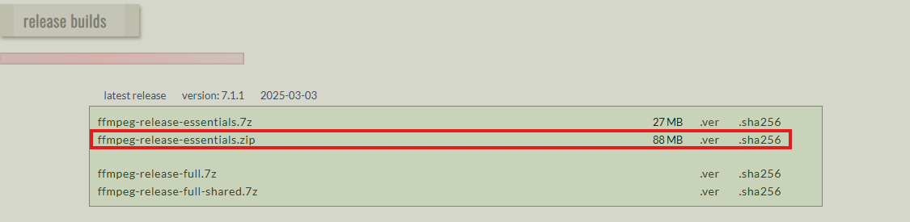

# RNG Game

This Python program acts as a generic RNG game, why would you waste your time playing this?

## Features
- Save and Load
- Rolling for one of 4 items
- Cutscene for 1 item
- A gear to increase your luck
- ???
- A way to view your collection

## Requirements
To run this program, you need to install the following dependencies:

- `pillow` for the icon photo.
- `simpleaudio` to play music.
- `pydub` to convert the music into data which `simpleaudio` understands
- `ffmpeg` to run pydub download [here](https://www.gyan.dev/ffmpeg/builds/)
- `Microsoft C++ v14.0.0+` to install `simpleaudio` download [here](https://visualstudio.microsoft.com/visual-cpp-build-tools/)

### Install dependencies
To install the required dependencies, you can run:

```bash
pip install -r requirements.txt
```
but to install ffmpeg and Microsoft C++?
Refer to the above links.

### Ffmpeg

<br>
Extract it to:

<br>
Now open this:<br>
