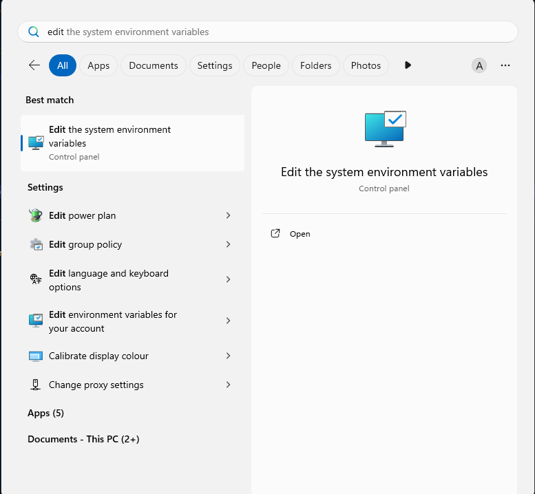

# RNG Game

This Python program acts as a generic RNG game, why would you waste your time playing this?

## Features
- Save and Load
- Rolling for one of many items
- Cutscene for some items
- Gears to increase your luck
- ???
- A way to view your collection
- Basic settings

## Requirements
To run this program, you need to install the following dependencies:

- `simpleaudio` to play music.
- `pydub` to convert the music into data which `simpleaudio` understands
- `ffmpeg` to run pydub download [here](https://www.gyan.dev/ffmpeg/builds/)
- `Microsoft C++ v14.0.0+` to install `simpleaudio` download [here](https://visualstudio.microsoft.com/visual-cpp-build-tools/)

### Install dependencies
To install the required dependencies, you can run:

```bash
pip install -r requirements.txt
```
but to install ffmpeg and Microsoft C++?
Refer to the above links.

### Ffmpeg

<br>
Extract it to:

<br>
Now at this point I reccomend renaming the folder to ffmpeg. Also ensure that it is only one folder deep (i.e. when you open the folder you will immediately see multiple folders instead of just one folder containing everything) if it isn't just extract that inner folder and rename it to ffmpeg and replace the previous folder with it.
<br>
Now open this:<br>

<br>
Click on this button:<br>

<br>
Click on Path:

<br>
Click on edit and then new and enter in C:\ffmpeg\bin
If you have done everything correctly you will have installed ffmpeg

### Microsoft C++

First go to the above link and download the set up, agree to the terms and it will download vs, now click on the C++ build tools, the nessecary downloads are checkmarked automatically, download it and you can now use:
```bash
pip install simpleaudio
```